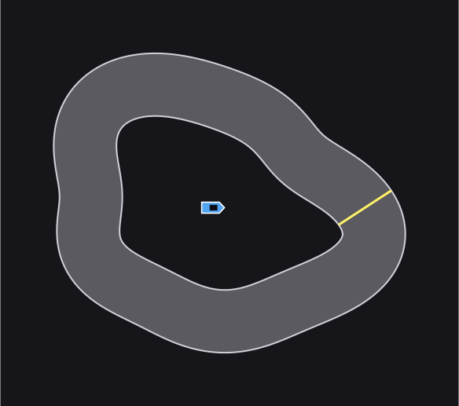
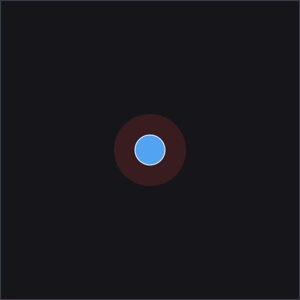

# Bascule

**Train game AI inside Godot — in pure C#, no Python, no native runtime.**

[](https://github.com/mfagerlund/Bascule/actions/workflows/ci.yml)
[](https://www.nuget.org/packages/Bascule.RL)
[](LICENSE)

A Godot 4 (.NET) integration for [Tensotron](https://github.com/mfagerlund/Tensotron), the
PyTorch-faithful tensor + autograd library for .NET. Drop a few components onto a node, declare
what it can *see*, *do*, and *be rewarded for*, set it to **Train** and press **Play**, and watch it
learn — all in-engine, in-process, on the same machine you build your game on.

> **Status: v1, working.** The RL core, the Godot addon, the example scenes, and the test suite all
> build and run today (`dotnet test` is green). The underlying engine
> ([Tensotron](https://github.com/mfagerlund/Tensotron)) is the PyTorch-faithful tensor + autograd
> library underneath; this project is the thin Godot-facing RL layer on top.

<p align="center">
  
  <br>
  <em>24 cars sharing one policy, after 60 generations of in-process PPO — no Python, no socket
  bridge, no native blob. Watch them learn it from scratch in the drift-racer section below.</em>
</p>

---

## Quickstart

```bash
git clone --recursive https://github.com/mfagerlund/Bascule.git
cd Bascule
dotnet test          # builds the RL core + runs the unit tests (no Godot needed)
```

The Godot-free RL core is also on NuGet — `dotnet add package Bascule.RL --prerelease` — for console
sims, tests, or other engines.

Then open the project in the **.NET/mono build of Godot 4.7+**, enable the **Bascule** plugin under
*Project Settings → Plugins*, open an example scene under `examples/`, and press **Play**. See
[Getting started](#getting-started) for the full train → save → infer loop.

---

## Why this exists

Every "C# ML for games" story today still trains in **Python**. Unity ML-Agents runs the agent in
C# but trains over a socket to a Python PyTorch process. `godot_rl_agents` is the same shape —
Godot collects experience, Python (Stable-Baselines3 / CleanRL) does the learning.

Bascule is the one that doesn't phone home: **collect, train, and infer all happen in your
Godot/.NET process.** No Python install, no ONNX export dance, no native blob. The whole loop is
managed C#, GPU-accelerated through ILGPU when you have a CUDA card and a fast hand-written SIMD CPU
backend when you don't.

That makes the killer workflow possible: **edit a reward, set the agent to Train, press Play, and see
the result in the same editor session.**

---

## The juicy part: things you can teach it

These are the example scenes that ship in `examples/`. Each is a few components on a node and a
reward function — the *learning arc* is what makes them fun to watch.

### 1. Pole-cart — the 60-second proof
A cart on a rail balancing a pole. The "hello world": it converges so fast you watch it happen live.

- **Sees:** cart position & velocity, pole angle & angular velocity (4 floats).
- **Does:** push left / right (1 continuous control).
- **Reward:** `+1` every physics tick the pole stays up; episode ends when it falls.
- **Arc:** *early* — flails, pole drops in half a second. *after a couple dozen iterations* — dead
  steady, cart parked under the pole. Good for proving the loop on any machine in under a minute.

### 2. The Turret — leading a moving target
A turret learns to track and hit a target that strafes and jukes. The example everyone asks for, and
the one that shows off a **mixed continuous + discrete** control surface.

```csharp
// Declare the control surface — the trainer never needs to know it's a gun.
ControlSpec Spec => new(new[] {
    new ControlChannel("YawDelta",   -1, 1),
    new ControlChannel("PitchDelta", -1, 1),
    new ControlChannel("Fire",        0, 1, IsDiscrete: true),
});
```

- **Sees:** target position & velocity relative to the muzzle, current aim, distance, cooldown flag.
- **Does:** yaw/pitch delta (continuous) + fire (discrete).
- **Reward:** `+1` hit, penalty on fire-and-miss, small shaping toward the aim.
- **Arc:** *early* — spins wildly and spams fire. *later* — holds fire, **leads** the moving target,
  squeezes the shot at the intercept point. It discovers lead pursuit without being told it exists.

### 3. Physics arm — torque control, not teleportation
A jointed arm driven by `ApplyTorque` on a Godot `RigidBody`, not by writing transforms. The example
for the **physics-control** training mode — harder and more realistic than direct control.

- **Sees:** joint angles & angular velocities, target direction.
- **Does:** joint torques (continuous).
- **Reward:** shaped toward reaching the target pose.
- **Why it matters:** demonstrates training *through* the physics solver, the mode you want for
  anything that should feel physical rather than animated.

### 4. Drift racer — a track from progress, not waypoints
A top-down car learns to drive (and power-slide) a closed circuit. No waypoints fed to the policy —
it reads its own state relative to the track centerline.

- **Sees:** forward & lateral speed, where it sits across the road, heading error to the track, and a
  short fan of look-ahead points down the centerline.
- **Does:** throttle + steer (continuous) and a discrete handbrake.
- **Reward:** progress along the centerline + a small carry-speed bonus; leaving the track ends the
  episode with a penalty. **Nothing in the reward asks for drifting** — the slide is emergent, because
  the traction model loosens at speed.
- **Arc:** *early* — spins off every corner. *later* — carries speed, holds the line, and slides the
  tight corners. Train 20 cars at once and watch the pack converge.

#### Watch it learn — one shared policy, four snapshots of the same run

Every car below is the *same policy* at a different point in training, replaying its best lap. Nothing
in the reward mentions corners or racing lines — it only knows "make progress along the centerline."
(Animated SVGs — they play on GitHub; open one to see it loop.)

<table>
<tr>
<td align="center" width="25%"></td>
<td align="center" width="25%"></td>
<td align="center" width="25%"></td>
<td align="center" width="25%"></td>
</tr>
<tr>
<td align="center"><b>Gen 5</b><br>spins off every corner</td>
<td align="center"><b>Gen 20</b><br>finding the line</td>
<td align="center"><b>Gen 40</b><br>most survive a lap</td>
<td align="center"><b>Gen 60</b><br>flowing the circuit</td>
</tr>
</table>

### 5. PuckWorld — keep-away, two drives at once
<p align="center">
  
</p>

The reinforcejs classic. A puck must **hug a green target** that teleports to a new spot every second,
while **fleeing a red enemy** whose danger ring slowly homes in. Two opposing drives in one reward, and
the learned behaviour reads at a glance: orbit the goal, peel away when the ring closes, drift back the
moment it's safe.

- **Sees:** its own position & velocity, the vector to the target, the vector to the enemy (8 floats).
- **Does:** a 5-way discrete nudge — left / right / up / down / coast, the shape Karpathy's DQN solved —
  *or* a 2-D continuous thrust. The **same arena drives either control surface** unchanged; the trainer
  reads the `ControlSpec` and never learns it's a puck.
- **Reward:** `−distance` to the target, minus a penalty that grows as the puck enters the enemy's ring.
- **Arc:** *early* — drifts aimlessly and wanders into the ring. *later* — parks on the target and
  slides out of the way the instant the enemy closes, then comes straight back.

#### Watch it learn — one shared policy, four snapshots of the same run

<table>
<tr>
<td align="center" width="25%"></td>
<td align="center" width="25%"></td>
<td align="center" width="25%"></td>
<td align="center" width="25%"></td>
</tr>
<tr>
<td align="center"><b>Gen 5</b><br>drifts aimlessly</td>
<td align="center"><b>Gen 30</b><br>starts to seek</td>
<td align="center"><b>Gen 80</b><br>hugs and dodges</td>
<td align="center"><b>Gen 200</b><br>confident keep-away</td>
</tr>
</table>

### More the same components unlock
The interface-discovery design (below) means *any* node that can `Write` an observation, `Apply` a
control, and report a `Reward` is trainable. Natural next examples — **not yet in the box** — include a
homing/proportional-navigation seeker, a legged walker (the engine trains exactly this headlessly),
steering/flocking swarms on one shared policy, drone stabilization, and crane/arm reaching tasks.
**If you can write a `Reward()` for it, you can train it.**

---

## How it works — the core idea

The whole design is *interface-driven discovery*. A node advertises three things; the trainer
composes everything else from them and never needs to know what the thing actually is.

```csharp
public interface IObservationSource { int Size { get; } void Write(Span<float> dst); }
public interface IControlSurface    { ControlSpec Spec { get; } void Apply(ReadOnlySpan<float> action, float dt); }
public interface IRewardSource      { float Reward { get; } bool Done { get; } void ResetEpisode(); }
```

`ControlSpec` is the keystone — it lets a control surface declare its channels and ranges, so a gun,
a car, a leg joint, and a shader parameter are all *just controls* to the optimizer:

```csharp
public sealed record ControlChannel(string Name, float Min, float Max, bool IsDiscrete = false);
public sealed record ControlSpec(ControlChannel[] Channels);
```

**The editor UX is the point:** drop a `LearningAgent` node above your arena, add an observation
source, a control surface, and a reward source (channels and ranges are declared in the surface's
`Spec`, in C#). Set the agent's `Mode` to **Train** in the inspector and press **Play** — the training
dock shows live loss / reward / episode plots. Click **Save Model** to write a `ModelResource`
(`.tres`), set `Mode` to **Inference**, and press Play again to run the trained policy. Ship the
`.tres`.

**Why it's fast in Godot:** Godot physics is single-threaded fixed-step, so "128 arenas in parallel"
means 128 agents stepping in *one* `_physics_process` tick — not 128 threads. Bascule
gathers every arena's observations into a single `[N, obs]` batch and runs **one** policy forward
pass per tick (a single cuBLAS GEMM on GPU, or the row-parallel SIMD matmul on CPU), then scatters
the actions back. That's the shape Tensotron is fastest at.

---

## What's in the box

```
Bascule/
├── addons/bascule/              # the Godot editor plugin (enable in Project Settings -> Plugins)
│   ├── plugin.cfg
│   ├── BasculePlugin.cs         # registers the training dock + debugger plugin
│   ├── LearningAgent.cs           # the node you drop on an arena: Train / Inference / Idle
│   ├── TrainingHud.cs             # in-game overlay (loss / reward / episode plots)
│   ├── TrainingDock.cs            # editor dock: live plots + Save Model
│   ├── TrainingDebuggerPlugin.cs  # streams stats from the running game to the dock
│   ├── RewardGraph.cs             # the plotting widget
│   └── resources/ModelResource.cs # the .tres-backed saved policy
├── src/Bascule.RL/              # engine-agnostic RL core — NO Godot dependency:
│   │                              #   PPO (Ppo, BatchedPpoTrainer, PpoUpdate), ActorCritic,
│   │                              #   ControlSpec/ActionLayout, CompositeAgent, ModelSerializer.
│   │                              #   Depends only on Tensotron. Extractable as its own package.
├── examples/                      # cartpole, physics (arm), turret, racing, puckworld
├── tests/Bascule.RL.Tests/      # xUnit tests for the RL core (Godot-free)
├── lib/Tensotron/                 # Tensotron engine — git submodule, pinned to a commit
└── README.md
```

Two deliberate boundaries:

- **Tensotron stays pure.** PPO, environments, and rollout buffers are *not* torch, so they live in
  `Bascule.RL`, never in Tensotron itself. Tensotron remains "PyTorch-faithful tensors," full stop.
- **The RL core is Godot-free.** `Bascule.RL` knows nothing about Godot — the `addons/bascule`
  layer adapts Godot nodes to its `CompositeAgent`/`IEnvironment`. That keeps the RL code reusable
  (console sims, other engines) and testable without an editor.

### Training modes (all three from day one)
- **Direct control** — `rotation += action * speed * dt`. Cleanest learning signal; the MVP default.
- **Physics control** — `body.ApplyTorque(...)`. Harder, more realistic; opt-in once the loop works.
- **Headless / accelerated** — `godot --headless`, many arenas per process, raised
  `PhysicsTicksPerSecond`. For real training runs you don't watch.

---

## Getting started

**Prerequisites:**
- the **.NET/mono build of Godot 4.7+** (the editor plugin uses the 4.7 `EditorDock` API — the
  standard, non-.NET Godot build will not work);
- a **.NET 8 SDK** (the RL core targets `net8.0`).

A CUDA GPU is optional — Tensotron uses it through ILGPU when present and falls back to its SIMD CPU
backend otherwise, so training and inference run on any machine.

```bash
git clone --recursive https://github.com/mfagerlund/Bascule.git
```

`--recursive` pulls the Tensotron engine into `lib/Tensotron`; `Bascule.RL` references it by
relative path, so the solution builds with no extra setup. (Already cloned without `--recursive`? Run
`git submodule update --init --recursive`.)

The train → ship loop:

1. Open the project in Godot and enable the **Bascule** plugin (*Project Settings → Plugins*).
2. Open an example scene (e.g. `examples/cartpole/CartPoleDemo.tscn`). Its `LearningAgent` is set to
   `Mode = Train`.
3. Press **Play**. Watch the training dock's live plots.
4. Click **Save Model** in the dock to write a `.tres`.
5. Set the agent's `Mode` to **Inference** (and point `Model` at the saved `.tres`), press Play, and
   watch the trained policy. Ship the `.tres` with your game.

---

## Training stability — a known limitation

This is in-process PPO, and PPO is famously stable early but can **degrade on long runs**: a policy
can climb to a peak and then collapse (entropy/σ shrinks toward a near-deterministic policy and the
critic drifts on the shifting state distribution). The library guards the *crash* — a
non-finite-update guard plus a running return-RMS value-target normalization keep a diverged step from
writing NaNs into the weights — and two on-by-default levers actively fight the *slow decay*:

- **KL early-stop (`TargetKl`, default 0.02).** Each update bails out the instant a minibatch's
  approximate KL between the rollout and updated policy exceeds `1.5 × TargetKl`, so one update can't
  yank the policy far enough to start the ratio-explosion / NaN cascade. Set `TargetKl ≤ 0` to disable.
- **Reactive LR backoff (`LrBackoffOnInstability`, default on).** The learning rate halves (down to
  `LrBackoffMinLr`) whenever the policy strains against that trust region — either a guarded crash
  (catastrophic) or `LrBackoffKlStreak` consecutive KL early-stops (the slow-drift signal). It settles
  into a stable plateau, effectively a soft auto-freeze at the peak.

Measured on the drift-racer pushed to 130 iterations at a deliberately aggressive learning rate, with
the best-checkpoint disabled so nothing masks the dynamics:

| | guarded updates | end-of-run return |
|---|---|---|
| neither lever | **1861** (NaN cascade) | collapsed (peaked ~38 → ~11) |
| both levers | **0** | **held at its ~30 peak** |

What the examples still do on top of these:

- **Checkpoint the best, not the last.** The demos track a smoothed best mean-return and save the
  model at its peak, not the final iteration.
- **Watch `LearningAgent.LastApproxKl` / `TotalSkippedUpdates` / `CurrentLearningRate`.** A KL well
  above `TargetKl`, a rising skip count, or a falling LR all show the stabilizers engaging.
- **Freeze when it's good.** The demos cap iterations and call `LearningAgent.Stop()` to lock the
  policy at its peak.

Further levers not yet built in (a small positive entropy coefficient is already exposed via
`EntropyCoef`; a higher σ floor and value-function clipping remain future work). See
[`docs/artifacts/ppo-value-divergence.md`](docs/artifacts/ppo-value-divergence.md) for the deeper
write-up of the value-divergence failure versus this slow collapse.

---

## v1 scope

**In v1:** the runtime training loop (PPO), `ModelResource` save/load, `ControlSpec` + mixed
continuous/discrete control surfaces, direct- and physics-control modes, the editor dock and in-game
HUD (loss / reward / episode plots + Save Model), and the cartpole, physics-arm, turret, and racing
example scenes.

**Explicitly not in v1:** distributed training, a Python bridge, a visual graph editor, a large RL
algorithm zoo, automatic curricula. Godot's community likes small composable tools — this stays one.

---

## Relationship to Tensotron

Bascule is a **thin wrapper**: all the tensor math, autograd, optimizers, and the
GPU/CPU backends come from [Tensotron](https://github.com/mfagerlund/Tensotron). This repo adds the
RL trainer, the environment abstraction, and the Godot bindings.

Tensotron is wired in as a **git submodule** under `lib/Tensotron`, and `Bascule.RL` references it
by relative path — so `git clone --recursive` builds the whole solution on any machine, pinned to an
exact engine commit. Tensotron is published on nuget.org as `Tensotron`; Bascule keeps the submodule
`ProjectReference` for engine co-development, and `dotnet pack` records it as a versioned package
dependency for consumers of `Bascule.RL`.

Both are **MIT, free, forever.** The Godot layer is the killer demo for the library, not a paywall.

---

## Credits

The drift/traction model in the racing example (`examples/racing/RaceCar.cs`) is ported from the
[kidscancode.org Godot "Car Steering" recipe](https://kidscancode.org/godot_recipes/4.x/2d/car_steering/),
itself based on the classic engineeringdotnet arcade-car algorithm. Credit retained inline at the
port site.

---

## License

MIT — see [LICENSE](LICENSE).
